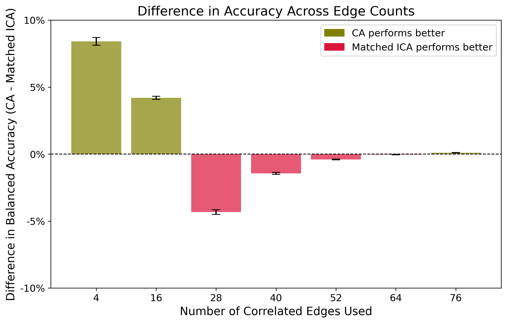
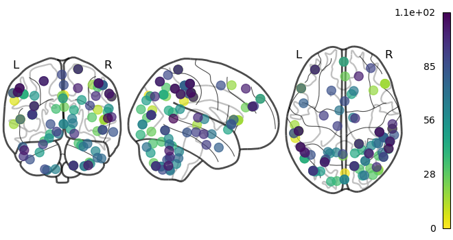

<h1>Predicting Handedness with Resting-State fMRI</h1>
  
By: Vicky Li, Anastasiya Markova, Zhuoxuan Ju; 
Mentors: Armin Schwartzman, Gabriel Riegner

<h2>Introduction</h2>

Have you ever wondered if your brain “knows” whether you’re left-handed or right-handed—without you even moving a finger? Turns out, it might!

Most research on handedness looks at brain activity during <b>task-based experiments</b> (like writing or grabbing an object) (put reference here!). But what if we could predict handedness <b>just from brain activity when you’re doing nothing at all</b>? That’s exactly what we set out to explore.

Using <b>resting-state fMRI</b> (a brain scan taken while people are simply lying still), we applied <b>machine learning</b> to see if brain connectivity alone can reveal whether someone is left- or right-handed.

<h3>Using machine learning models, we investigated:</h3>
<ul>
  <li>Whether functional brain connectivity patterns differ between left- and right-handed individuals</li>
  <li>The role of interhemispheric connectivity in these predictions</li>
  <li>How well different machine learning models perform in classifying or predicting handedness based on brain connectivity</li>
</ul>

<h2>Data</h2>

We used brain scan data from the <b>Human Connectome Project (HCP)</b>, which has fMRI recordings from <b>1003 subjects</b>. Each person’s scan captured <b>one hour</b> of brain activity while they were at rest—no thinking, no moving, just the brain doing its thing.

<h3>How is the brain data organized?</h3>

Imagine the brain as a giant network of interconnected regions. We studied two different ways to divide it:

  <ul>
  <li><b>ICA Parcellation (300 Regions):</b>
    <ul>
      <li>Groups brain activity <b>based on signal patterns</b>, not physical location.</li>
      <li>Regions might spread across both hemispheres.</li>
      <li>Useful for broad connectivity patterns.</li>
      <li>Here we can put the interactive plot/plot that shows how ICA parcellation looks like.</li>
    </ul>
  </li>

  <li><b>CA Parcellation (718 Regions):</b>
    <ul>
      <li>Divides the brain into <b>specific anatomical areas</b> (left vs. right hemisphere).</li>
      <li>Helps study how connectivity between hemispheres affects handedness.</li>
      <li>Here we can put the interactive plot/plot that shows how CA parcellation looks like.</li>
    </ul>
  </li>
</ul>

<h3>How do we measure handedness?</h3>

We used the <b>Edinburgh Handedness Inventory (EHI)</b>, a questionnaire that asks about daily tasks like writing, throwing, and using utensils.

<ul>
  <li><b>Score > 0:</b> Right-handed </li>
  <li><b>Score < 0:</b> Left-handed </li>
  <li><b>Score = 0:</b> Ambidextrous </li>
</ul>

<h3>Balancing the Data ⚖</h3>

There’s a catch: Most people (about <b>90%</b>) (we need reference here!) are right-handed, which makes lefties <b>a rare find</b> in our dataset.

<ul>
  <li><b>ICA Data (All subjects):</b> 88 left-handers, 912 right-handers, 3 ambidextrous</li>
  <li><b>CA Data (Subset of 165 subjects):</b> 12 left-handers, 153 right-handers</li>
</ul>

To prevent our machine learning models from being biased toward right-handers, we used a technique called <b>SMOTE (Synthetic Minority Oversampling Technique)</b> to create <b>synthetic left-handed data points</b> based on the real data points to generate synthetic samples for the minority class to improve model balance and performance. 

<h2>Methods</h2>

  
I think here we can put the plot of the correlation matrice generation process we use for the poster, as well as the process diagram we have in the poster. (will be removed in final version)

  
Handedness can be viewed as binary, left or right-handed, as well as continuous based on the Edinburgh Handedness Index. This led us to explore two types of models: regression and classification.

    
  
Both models utilize functional connectivity, which we calculated through partial correlation matrices for each subject. For the CA data, the correlation matrix was 718 by 718, corresponding to all possible pairs between 718 regions. For the All ICA and Matched ICA data, the correlation matrices were 300 by 300, corresponding to 300 regions used. We applied Fisher Z-transformation to normalize the correlations.

  
Every value inside the correlation matrix is the correlation between two brain regions which forms an edge. We can now think of every value in the correlation matrix representing an edge. We computed the correlation between a particular edge across all subjects and the corresponding handedness scores. Top n number of absolute strongest correlations were used as inputs into the model. The appropriate number of n edges was selected via grid search. 

    
<h3>Classification</h3>
  
For classification, we used a model that always predicts mode as our baseline. The balanced accuracy score was used for evaluation, with a baseline score of 0.5.

    
  
Since left-handed people make up less than 10% of our dataset, we used the Synthetic Minority Oversampling Technique (SMOTE) to rebalance the dataset. This technique uses a nearest neighbors approach. It takes a point, finds k nearest neighbors, randomly selects one of the nearest neighbors, and adds a point on the linear path between our point and the random neighbor we chose. We then separate our balanced dataset into 25% test and 75% train sets. 

  
We implemented K-Nearest Neighbors (KNN) classifiers first, and performed grid search to identify the hyperparameters which correspond to the best balanced accuracy score. 

    
<h4>K-Nearest Neighbors (KNN) Classifier</h4>
  <table>
      <tr>
          <th>Dataset</th>
          <th>Number of Edges</th>
          <th>Value of k</th>
          <th>Accuracy</th>
      </tr>
      <tr>
          <td>Matched ICA</td>
          <td>60</td>
          <td>3</td>
          <td>1.00</td>
      </tr>
      <tr>
          <td>CA Data</td>
          <td>15</td>
          <td>3</td>
          <td>0.99</td>
      </tr>
      <tr>
          <td>All ICA</td>
          <td>5</td>
          <td>3</td>
          <td>0.95</td>
      </tr>
  </table>
  
<h4>Support Vector Classifier (SVC)</h4>
  
Then we implemented a Support Vector Classifier (SVC), and performed a similar grid search of the hyperparameters. After trying <b>linear</b>, <b>poly</b>, <b>rbf</b>, <b>sigmoid</b> kernels, only the sigmoid kernel produced reliably stable results, so it was chosen for the model.

  

  
  

  
where the kernel coefficient `alpha` controls the influence of each training sample on the decision boundary and is the bias term <b>c</b> that shifts the data up or down.

  
In the sigmoid kernel, the similarity between two data points is computed using the hyperbolic tangent function <b>tanh</b>. The kernel function scales and possibly shifts the dot product of the two points <b>x</b> and <b>y</b>.

  
  
After testing different kernels, the sigmoid kernel was chosen for stability.

  <table>
      <tr>
          <th>Dataset</th>
          <th>Number of Edges</th>
          <th>Accuracy</th>
      </tr>
      <tr>
          <td>Matched ICA</td>
          <td>68</td>
          <td>1.00</td>
      </tr>
      <tr>
          <td>CA Data</td>
          <td>72</td>
          <td>1.00</td>
      </tr>
      <tr>
          <td>All ICA</td>
          <td>60</td>
          <td>0.94</td>
      </tr>
  </table>

  
When analyzing the performance, we ran each model 500 times on different train-test splits to make sure that our results are consistent. We will be reporting average balanced accuracy across 500 trials in our results.

  
In order to achieve a greater level of explainability, since the sigmoid kernel is hard to interpret, permutation testing was conducted to evaluate the importance of each feature passed into the model. We first conducted hierarchical clustering to filter out features that are correlated with each other, and reduce multicollinearity within the dataset. First, we extracted our features, which are the values of the edges across all subjects. Then, we compute Spearman correlation between multiple edges. Spearman correlation assesses whether the relationship between two variables can be described using a monotonic function, a function that preserves or reverses the order of the given order. This will help us reduce the number of input edges, since many of them follow the same pattern. Then, the distance matrix is computed using 1 - abs(corr), such that if the spearman correlation coefficient was high, close to 1 or -1, the distance would be small, close to 0. Then, we use Ward's method for hierarchical clustering, which minimizes the variance within clusters. In order to appropriately threshold hierarchical clustering, we computed a grid search using the following objective function. 

  

  
  

  
The goal of this function was to maximize the balanced accuracy of the model as well as maximize the threshold. This way we are searching for the minimal number of edges while still achieving maximum accuracy. Once we selected the threshold, we filtered the features such that only one feature from every cluster is included in the model. Then, permutation testing was conducted to assess how significantly each feature affects the model. The permutation test shuffles the values of a specific feature, and assesses by how much the model performance decreased on average across multiple iterations. Through these processes we were able to assess  which brain regions most significantly impact the performance of our model.

    
<h3>Regression</h3>
  
For regression, we aimed to predict handedness as a continuous variable ranging from -100 to +100 using connectivity features. Same as with classification, the inputs into our model were the edge values across all subjects. We used a model that always predicts the mean as our baseline. We use the evaluation technique of Root Mean Squared Error (RMSE), which is the square root of the mean squared difference between true and predicted values. We looked for an RMSE lower than the baseline model when creating new models.

    
  <h4>K-Nearest Neighbors Regressor</h4>
  
We started by applying the K-Nearest Neighbors Regressor. Similar to classification, we performed grid search to look for the optimal number of  edges and k values to include in our model.

  <table>
      <tr>
          <th>Dataset</th>
          <th>Number of Edges</th>
          <th>k</th>
          <th>RMSE</th>
      </tr>
      <tr>
          <td>Matched ICA</td>
          <td>130</td>
          <td>4</td>
          <td>20.9</td>
      </tr>
      <tr>
          <td>CA Data</td>
          <td>50</td>
          <td>4</td>
          <td>17.8</td>
      </tr>
      <tr>
          <td>All ICA</td>
          <td>40</td>
          <td>10</td>
          <td>38.13</td>
      </tr>
  </table>
  
  <h4>Spectral Embedding</h4>
  
Our second model is Spectral Embedding, which works by computing the graph Laplacian of a similarity matrix derived from the data, performing an eigenvalue decomposition, and selecting the eigenvectors associated with the smallest eigenvalues. These eigenvectors form the new lower-dimensional coordinates for the data, capturing the essential structure of the dataset in fewer dimensions. Since the Laplacian matrix depends on the similarity matrix, we have to apply it to the whole dataset rather than splitting it into a train and test set. We applied spectral embedding to reduce our dimensionality to just one or two dimensions. When Spectral embedding reduced our data to two dimensions, Principal Component Analysis was used to further reduce it to a single dimension and then apply linear regression where x are spectrally embedded values, while y are handedness scores.

<h2>Results</h2>

<h3>Classification</h3>
  
We employed all the models to the three datasets: All ICA, Matched ICA, and CA. We ran each model 500 times on different train-test splits to ensure consistent results.

  
  
Comparison of Classification Models using 60 edges total, across different datasets.

  
  
On All ICA data, the KNN model slightly outperformed the SVC model with an average balanced accuracy of 0.95 compared to 0.94 for SVC. Both models significantly outperformed the baseline. On Matched ICA data, both KNN and SVC achieved 100% balanced accuracy. For the CA dataset, which separated data by hemispheres and included subcortical regions, both models performed similarly with 99% balanced accuracy.

  

  
  
  <h4>Effect of Edge Count on Performance</h4>
  
We examined how the number of edges affected performance. CA performed better with fewer edges compared to Matched ICA. Matched ICA caught up and eventually outperformed CA, but over time, both datasets performed similarly.

  
  <h4>Feature Selection</h4>
  
To better understand why the models performed well, we conducted hierarchical clustering and permutation testing to identify the most important features.

  
  <h4>Results After Hierarchical Clustering & Permutation Testing</h4>
  <table>
      <tr>
          <th>Dataset</th>
          <th>Number of Edges</th>
          <th>Balanced Accuracy</th>
      </tr>
      <tr>
          <td>Matched ICA</td>
          <td>16</td>
          <td>0.976</td>
      </tr>
      <tr>
          <td>CA</td>
          <td>8</td>
          <td>0.955</td>
      </tr>
      <tr>
          <td>All ICA</td>
          <td>57</td>
          <td>0.937</td>
      </tr>
  </table>
  
  <h4>Key Regions for Classification</h4>
  
CA data: 

  

  
Matched ICA. In the matched ICA result, the centroids of the regions important for classification tend to be towards the back in the cerebellum and occipital regions.

  

  
All ICA. In all ICA data, the regions are present more evenly spread out throughout the brain, however, there does seem to be a cluster towards the back of the brain.

  
These regions are harder to visualize in the CA data, since some of them are subcortical, the cortical regions look as follows:

  
Brain Region Views 1: 

  
Brain Region Views 2: 

  
The Brain Region Views 1 is a view from above, while the other is the view from the back of the brain. The highlighted areas are present towards the front of the brain as well as towards the back. 

  
  <h3>Regression Model</h3>
  
Consistently we saw that the regions towards the back of the brain, the occipital lobe as well as in the cerebellum seem to be important to our classification.

  

  
Our regression model varied in results, the performance of the Spectral Embedding as well as the KNN regressor worked well on our Matched ICA and CA datasets. The performance of the two models is comparable. Both models tend to perform slightly better on the CA dataset compared to the Matched ICA dataset. Both of the models barely outperform the baseline model on the All ICA dataset, showing poor performance. 

<h2>Discussion</h2>

Our results show that the Matched ICA and CA datasets have similar performance, but their performance differs significantly from that of the whole subject pool. The similar performance of ICA Matched and CA data was an unexpected outcome, as we predicted that parcellations recognizing hemispheres would be important for predicting handedness. However, it appears that this is not the case. We also note that the CA dataset, which divides brain regions by hemispheres, performs just as well with less information compared to the model trained on the Matched ICA dataset. This suggests that while the presence of lateralization may be useful in predicting handedness, it is not vital. There seems to be a broader brain connectivity pattern that represents handedness, regardless of lateralization.

    

Additionally, the performance of both regression and classification models on the All ICA dataset was significantly worse than on the other two datasets, which are subsets of the All ICA data. We hypothesize that individuals in the subset have higher-quality data because they were selected based on having undergone more scans than the majority of the dataset. These individuals may be better suited for resting-state fMRI (rfMRI).

Our hierarchical analysis revealed that many brain regions are meaningful for prediction. These regions are distributed throughout the brain, rather than being localized specifically to the motor area. We found that several regions in the occipital lobe and cerebellum were useful for the model’s prediction. This was a surprising finding, as most prior research (e.g., Pool et al., 2015) has focused on areas within the primary motor cortex. That being said, our exploration of regions was quite preliminary, and further hypothesis testing would be needed to establish which regions are specifically predictive of handedness. For now, the regions we've identified work well for prediction, but it remains unclear how closely they are tied to handedness or whether there are confounders that influence the performance of our model. This remains an area for future exploration.

The limitations of our model are also influenced by the size of the dataset. Left-handed individuals make up less than 10% of our dataset, which is a very small sample size. This sample may not be representative of the broader left-handed population. While our model performs well on the current datasets, it is important to acknowledge that our sample may be too small to accurately reflect the overall pattern in the data. It is possible that the effectiveness of our model could be due to a fortunate sample that highlights differences between left- and right-handed individuals. If we were to sample 900 more left-handed individuals, the data might not exhibit these patterns, and the groups could be indistinguishable. This is another area of future research.

<h2>Conclusion</h2>
    
Overall, we achieved classification accuracies ranging from 0.95 to 1.00 on all datasets using the Support Vector Classifier with a sigmoid kernel. While separating the data by hemispheres can yield high accuracies with fewer features, it is not essential for achieving a high accuracy score. This suggests that handedness is represented not only by hemispheres but also by larger brain connectivity patterns. The high performance of our models indicates that handedness can be predicted, but further research is needed to identify which brain regions and features are most useful for the model. Additionally, a major limitation is the size and imbalance of the dataset, which prevents us from confidently asserting that these results are generalizable to the broader population.

<h2>Reference</h2>
<ul>
    <li>Pool, E.-M., Rehme, A. K., Eickhoff, S. B., Fink, G. R., & Grefkes, C. (2015). Functional resting-state connectivity of the human motor network: Differences between right- and left-handers. <em>NeuroImage, 109</em>, 298–306. https://doi.org/10.1016/j.neuroimage.2015.01.034</li>
    <li>Pujol, J., Deus, J., Losilla, J. M., & Capdevila, A. (1999). Cerebral lateralization of language in normal left-handed people studied by functional MRI. <em>Neurology, 52</em>(5), 1038–1043. https://doi.org/10.1212/wnl.52.5.1038</li>
    <li>Meszlényi, R. J., Buza, K., & Vidnyánszky, Z. (2017). Resting State fMRI Functional Connectivity-Based Classification Using a Convolutional Neural Network Architecture. <em>Frontiers in neuroinformatics, 11</em>, 61. https://doi.org/10.3389/fninf.2017.00061</li>
    <li>Van Essen, D. C., Smith, S. M., Barch, D. M., Behrens, T. E., Yacoub, E., Ugurbil, K., & WU-Minn HCP Consortium (2013). The WU-Minn Human Connectome Project: an overview. <em>NeuroImage, 80</em>, 62–79. https://doi.org/10.1016/j.neuroimage.2013.05.041</li>
    <li>Glasser, M.F., Sotiropoulos, S.N., Wilson, J.A., Coalson, T.S., Fischl, B., Andersson, J.L., Xu, J., Jbabdi, S., Webster, M., Polimeni, J.R., Van Essen, D.C., & Jenkinson, M. (2013). The minimal preprocessing pipelines for the Human Connectome Project. <em>NeuroImage, 80</em>, 105-124.</li>
    <li>Filippini, N., MacIntosh, B.J., Hough, M.G., Goodwin, G.M., Frisoni, G.B., Smith, S.M., Matthews, P.M., Beckmann, C.F., & Mackay, C.E. (2009). Distinct patterns of brain activity in young carriers of the APOE-e4 allele. <em>Proc Natl Acad Sci USA (PNAS), 106</em>, 7209-7214.</li>
    <li>Ji, J. L., Spronk, M., Kulkarni, K., Repovš, G., Anticevic, A., & Cole, M. W. (2019). Mapping the human brain's cortical-subcortical functional network organization. <em>NeuroImage, 185</em>, 35-57. https://doi.org/10.1016/j.neuroimage.2018.10.006</li>
    <li>Oldfield, R. C. (1971). The assessment and analysis of handedness: the Edinburgh inventory. <em>Neuropsychologia, 9</em>(1), 97–113. https://doi.org/10.1016/0028-3932(71)90067-4</li>
</ul>

